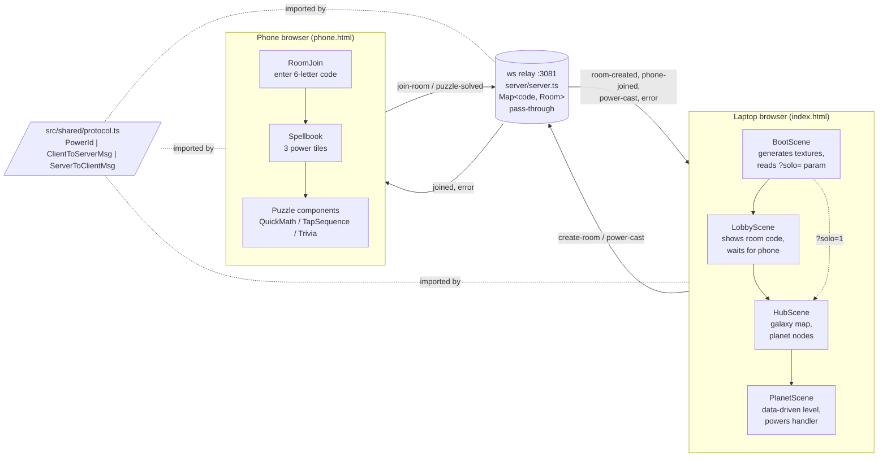

# Constellation

> Asymmetric cozy 2-player co-op. The laptop runs a Phaser platformer; the phone runs React puzzles. A tiny `ws` relay glues them via a 6-letter room code, and solving a puzzle on the phone casts a power that reshapes the laptop's world.


-98ffc8)

---

## Table of contents

- [TL;DR](#tldr)
- [What this project is](#what-this-project-is)
- [Tech stack](#tech-stack)
- [Architecture](#architecture)
- [Key flows](#key-flows)
  - [1. Two-device handshake (room code)](#1-two-device-handshake-room-code)
  - [2. Cast lifecycle (phone puzzle → laptop effect)](#2-cast-lifecycle-phone-puzzle--laptop-effect)
  - [3. Playing through a planet](#3-playing-through-a-planet)
  - [4. Solo dev mode (no phone, no relay)](#4-solo-dev-mode-no-phone-no-relay)
- [Project history](#project-history)
  - [Milestone summary](#milestone-summary)
  - [Decisions and tradeoffs](#decisions-and-tradeoffs)
  - [Full chronology](#full-chronology)
- [Repository structure](#repository-structure)
- [User guide](#user-guide)
  - [Prerequisites](#prerequisites)
  - [Installation](#installation)
  - [Configuration](#configuration)
  - [Running locally](#running-locally)
  - [Usage examples](#usage-examples)
  - [Common workflows](#common-workflows)
  - [Troubleshooting](#troubleshooting)
  - [Deployment](#deployment)

---

## TL;DR

I built Constellation as a two-player cozy co-op game with an unusual split: one person plays a side-scrolling platformer on a laptop while the other plays phone-based puzzles to cast "powers" that change the laptop's world. The two devices don't talk to each other directly — they meet through a tiny relay server that pairs them by a 6-letter room code, and from then on the phone is effectively a magical remote control.

The most interesting thing about it is how the wire protocol enforces design discipline: a single `PowerId` union in `src/shared/protocol.ts` is the only thing that has to agree across the game, the phone, and the relay. Adding a new power means wiring four sides (protocol literal, spellbook tile, puzzle component, cast handler) — the TypeScript exhaustiveness check makes it impossible to forget one.

## What this project is

Constellation is a portfolio prototype I'm building to explore *asymmetric* co-op as a genre — both players play the same game, but they don't play the same way at all. The laptop player runs and jumps through tiny planet-worlds. The phone player sees a spellbook of three powers; tapping one opens a quick puzzle (mental math, a Simon-Says memory game, or trivia) and solving it casts the corresponding power on the laptop's level — freezing enemies, summoning bridges across chasms, or revealing hidden platforms inside dark zones.

It's aimed at couples and friends who want a low-twitch, conversational game session: the laptop player needs the phone player's help, and the phone player only gets to participate by actually solving puzzles. Neither side is decorative.

**Status:** active development, currently shipping milestone **M4** (galaxy hub + data-driven planets) on branch `feat/m4-hub-foundation`. M0–M3 are merged to `main`: scaffolding, room-code handshake, the three-power spellbook, a capstone level that requires all three, and a cleanup pass with a restart button and a `?solo=1` developer mode. Per the project's stated test gate, this is a portfolio piece in the hands of a single planned playtester — the "is it fun?" check is the integration test, deliberately.

## Tech stack

| Component | Tool / library | Why I chose it |
|---|---|---|
| Language | TypeScript 5.7 with `strict`, `noUnusedLocals`, `noUnusedParameters`, `noImplicitReturns` | One language across game, phone, server, and the wire protocol. Strict mode catches the "you wired three of four sides" class of bug. |
| Game client (laptop) | Phaser 3.80 + Arcade Physics | Mature 2D platformer engine with cheap arcade physics. Generated solid-color textures (in `Boot.ts`) keep the prototype assetless. |
| Phone client | React 19 + functional components, inline `style={{}}` only | Hooks-first; phone UI is small enough that a single file per puzzle reads better than CSS modules. Inline-only is a hard rule (see CLAUDE.md). |
| Relay server | Node + `ws` 8 (run with `tsx` in dev) | One file, in-memory `Map<roomCode, Room>`, pass-through forwarding. No DB, no framework — the smallest thing that could glue two browsers. |
| Bundler / dev server | Vite 6 (multi-entry: `index.html` for game, `phone.html` for phone) | Vite binds `0.0.0.0` so the phone can reach the laptop's LAN URL on the same wifi. One config, two entry points. |
| Process manager | `concurrently` | Runs the Vite dev server and the relay together under one `npm run dev`. |
| Type-only shared module | `src/shared/protocol.ts` | A single file is the entire boundary contract between game and phone. The relay only deserializes `type` and `powerId` enough to forward — no domain knowledge on the server. |

No tests yet. The README and CLAUDE.md both call this out: the M2 "is it fun?" playtest is the project's stated integration gate, and a real test suite is deferred until that gate lands.

## Architecture

Three processes, one wire protocol, one room code:



The relay is intentionally dumb. It only knows two things: how to pair a `game` socket with a `phone` socket under a 6-letter code, and how to forward a `cast-power` or `puzzle-solved` message to the other side as a `power-cast`. All game logic — what a power *does*, what a puzzle *is*, whether the level is won — lives in the client. CLAUDE.md formalizes this as a project rule.

The laptop scene graph is a four-step flow: `BootScene` generates the few solid-color textures the game needs and decides whether to launch into normal co-op (`LobbyScene`) or solo dev mode (jumps straight to `HubScene` with a stub `GameNetClient` that never connects). `HubScene` is a starfield with one playable planet node and two locked placeholders. `PlanetScene` is the level itself — `init()` takes a `PlanetConfig` object, so the same scene class will render Planet 2 and Planet 3 once their configs exist.

The phone is a single React app with a `Phase` state machine: `idle` → `connecting` → `spellbook` → `puzzle` → `cast-feedback` → back to `spellbook`. Each puzzle is a component that takes a `{ onSolved, onCancel }` contract and nothing else — `App.tsx` is responsible for actually sending the `puzzle-solved` message to the relay.

## Key flows

### 1. Two-device handshake (room code)

**Entry point:** the laptop loads `http://localhost:5180`, the phone loads `http://<laptop-LAN-IP>:5180/phone.html`.

1. Laptop runs `src/game/main.ts`, which mounts the Phaser game with scenes `[Boot, Lobby, Hub, Planet]`.
2. `BootScene.create()` generates seven solid-color textures (`astronaut`, `ground`, `ceiling`, `enemy`, `goal`, `platform`, `hidden-platform`) and starts `LobbyScene` (because no `?solo=1` is present).
3. `LobbyScene.create()` constructs a `GameNetClient`, calls `.connect()` which opens a WebSocket to `ws://<host>:3081`, and immediately sends `{ type: 'create-room', role: 'game' }`. The relay responds with `{ type: 'room-created', roomCode: 'ABCDEF' }`, which the lobby renders in a giant 88-pixel mustard-yellow text block.
4. On the phone, `App.tsx` mounts with `Phase = idle` and shows `RoomJoin`, an uppercase-only 6-character input.
5. The user types the code; `handleJoin` constructs a `PhoneNetClient`, awaits `connect()` (which resolves on the WebSocket's `open` event), then sends `{ type: 'join-room', role: 'phone', roomCode: code }`.
6. In `server/server.ts`, the relay looks up the room, attaches the phone socket as `room.phone`, sends `{ type: 'joined' }` to the phone and `{ type: 'phone-joined' }` to the game.
7. The lobby flips its status text to "Phone connected — starting…" and after a 900ms delay starts `HubScene` with `{ net, solo: false, unlockedPlanets: new Set(['planet-1']) }`. The phone simultaneously transitions to `Phase = spellbook`.

The two devices are now paired by a room object in the relay's `Map<string, Room>` and a shared `roomCode` string. Neither device ever knows the other's IP — the relay is the only thing they both talk to.

### 2. Cast lifecycle (phone puzzle → laptop effect)

This is the core game loop. Tracing a Freeze Stars cast end-to-end:

1. Phone shows `Spellbook`, which is just three `<button>`s defined in `src/phone/components/Spellbook.tsx` with hardcoded power metadata (`label`, `subtitle`, `accent`).
2. User taps "Freeze Stars". `App.tsx`'s `pickPower` callback transitions to `Phase = { kind: 'puzzle', power: 'freeze-stars' }`, which renders `<QuickMath onSolved={onSolved} onCancel={onCancel} />`.
3. `QuickMath` (`src/phone/components/puzzles/QuickMath.tsx`) generates 3 random arithmetic problems (add/subtract/multiply, with hand-picked operand ranges), shows them one at a time with a 30-second total countdown, and calls `onSolved()` only when the third problem is answered correctly. Wrong answers flash a pink border for 350ms; timeout calls `onCancel`.
4. `onSolved` in `App.tsx` does two things atomically: sends `{ type: 'puzzle-solved', powerId: 'freeze-stars' }` to the relay, and transitions the phone to `Phase = cast-feedback` (a 1.2-second "Cast!" splash before returning to the spellbook).
5. The relay's `ws.on('message')` handler receives the `puzzle-solved` message and, because the sender's `role === 'phone'`, forwards it to the game socket as `{ type: 'power-cast', powerId: 'freeze-stars' }`.
6. On the laptop, the `PlanetScene.create()` callback registered with `this.net.onMessage()` receives the message and dispatches to `this.castPower('freeze-stars')`.
7. `castPower` is a single `switch` with an `_exhaustive: never` check at the bottom — so adding a fourth `PowerId` to `protocol.ts` would immediately produce a TypeScript error here. For Freeze, it calls `this.enemy.freeze(3000, this)`, which tints the enemy cyan, zeroes its velocity, and schedules a `delayedCall` to thaw it. A "FREEZE!" banner flashes onscreen for ~700ms.
8. The astronaut can now run past the frozen enemy.

Summon Platform and Illuminate are variations on the same pattern: different puzzle (`TapSequence`, `Trivia`), different cast handler (`summonPlatform()` creates a static sprite that fades out after 5s; `illuminate()` tweens the dark-zone rectangle to alpha 0 over 800ms and destroys it). The platform power guards against double-cast with `if (this.platforms.getChildren().length > 0) break;`; illuminate's re-cast intentionally still fires the banner because the trivia puzzle is a 30-second investment and silent no-ops feel like a bug to the player.

### 3. Playing through a planet

The current level (`planet1Config` in `src/game/planets/planet1.ts`) is a single 960×540 room that requires all three powers in sequence:

1. **Spawn at (80, 440)** on a tiled ground strip. The astronaut moves with WASD or arrow keys, jumps with W/Up/Space (`Astronaut.update()` in `src/game/entities/Astronaut.ts`).
2. **Corridor at x=420** has a plasma-column ceiling (`ceiling` texture) low enough that the patrolling enemy (`Enemy` class, patrols ±140px around its spawn) cannot be cheese-jumped over. The phone player solves Quick Math, the enemy freezes for 3 seconds, the astronaut runs through.
3. **Chasm from x=660 to x=880** is generated by skipping ground tiles in that range. The astronaut falls in → `update()` checks `astronaut.sprite.y > fallRespawnY (600)` → `resetAstronaut()` snaps them back to spawn with a pink tint. The phone player solves the Tap Sequence (a 4-color Simon-Says, 5-step sequence, 25-second timer), the cast spawns a purple platform at (770, 460) for 5 seconds. The platform fades over its last 800ms — a built-in "use it or lose it" cue.
4. **Dark zone at (920, 420)** is a 160×100 opaque black rectangle covering a hidden platform sprite. Reaching the goal at (920, 300) requires standing on that hidden platform — direct jump from the floor misses by roughly 21px per the M3 capstone reach math. The phone player solves Trivia (3 multiple-choice questions sampled from a pool of 12, 30-second timer, wrong answer resets to question 1 with a fresh sample), the dark zone fades out, the path is revealed.
5. **Goal at (920, 300)** is an animated yellow square with a yoyo bob tween. Touching it sets `won = true` and calls `showWin()` — a dimmed overlay with "Play again" (calls `scene.restart` preserving `{ net, config, solo, unlockedPlanets }`) and "Return to Hub" (calls `scene.start('Hub', …)`) buttons.

The level config is data — all the magic numbers (spawn, goal, pit bounds, corridor x, platform drop point, hidden platform position, dark zone rectangle, fall threshold) live in the `PlanetConfig` type. M4's `refactor(m4): generalize Level scene into data-driven Planet scene` commit pulled this apart so Planet 2 (ice) and Planet 3 (library) can be new configs without forking the scene class.

### 4. Solo dev mode (no phone, no relay)

Opening `http://localhost:5180/?solo=1` short-circuits the entire co-op flow:

1. `BootScene` reads the URL param. If `solo=1`, it constructs a `GameNetClient` *but never calls `.connect()`* — the client's `ws` stays `null`, and `.send()` is a no-op because `readyState !== OPEN`.
2. Instead of starting `LobbyScene`, Boot jumps straight to `HubScene` with `solo: true`.
3. `PlanetScene` notices `this.solo` in `create()` and registers keyboard handlers — `keydown-ONE` calls `castPower('freeze-stars')`, `TWO` → `summon-platform`, `THREE` → `illuminate`. A "SOLO  [1] freeze  [2] platform  [3] illuminate" badge renders in the top-left.
4. The same `castPower` function is called by both the wire-message handler and the keyboard handler — one switch, one exhaustiveness check, no drift.

The relay is never contacted in this mode, which makes solo iteration trivial: launch the dev server, open one tab, hit `1`/`2`/`3`. The price is that I had to extract `castPower` into a named method, which I'd been resisting; the M3 cleanup PR is what finally forced it.

## Project history

### Milestone summary

The repo uses an M-prefix milestone scheme in commit messages (`feat(m3): …`, `chore(m4): …`). High-level plan lives outside the repo at `~/.claude/plans/i-ve-started-this-in-fluttering-tiger.md`; what's visible from git history:

- **M0 — Skeleton (2026-04-22).** Vite + Phaser + React multi-entry scaffold. One commit (`f503ff3`) sets up everything: `index.html` for the game, `phone.html` for the phone, two TypeScript entry points, a strict `tsconfig.json`.
- **M1 — Room-code handshake (2026-04-24).** Single commit (`fadc3e3`): the `ws` relay, the `GameNetClient` / `PhoneNetClient` pair, the `LobbyScene`, the `RoomJoin` component, and the first version of `protocol.ts`.
- **M2 — One power, one level (2026-04-24).** Two commits: `2f5b550` ships Freeze Stars + QuickMath end-to-end (the first complete cast loop), and `adac809` adds the plasma-column obstacle so the corridor can't be cheese-jumped without the freeze.
- **M3 — Spellbook trio + capstone (2026-05-12 → 2026-05-13).** Three merged PRs (#1, #2, #3). PR #1 was the big one: Summon Platform + TapSequence puzzle, Illuminate + Trivia puzzle, and a single level that *requires all three powers in sequence* (the M3 capstone). PR #2 docs-only — captured the player-specialization idea as a deferred-direction note. PR #3 cleanup pass: synced the freeze-duration drift between README and code, replaced "refresh to play again" with an in-game restart button, and shipped `?solo=1` dev mode.
- **M4 — Galaxy hub and data-driven planets (2026-05-14, in progress).** Three direct commits on the `feat/m4-hub-foundation` branch: an orchestrator plan (`7af134a`), a refactor of `Level.ts` into a data-driven `PlanetScene` (`ac90591`), and the new `HubScene` with one playable planet node and two locked placeholders (`4ed8f13`). Planet 2 (ice) and Planet 3 (library) are in the backlog but not yet picked.

### Decisions and tradeoffs

A few decisions visible in the history that I think are interesting:

1. **Three-process split was the design, not an accident.** From the M0 commit forward, the laptop is Phaser and the phone is React — not "both React" or "both Phaser." The asymmetry of the *gameplay* is mirrored by the asymmetry of the *codebase*, which means each side gets to use the most natural tool. The cost is two distinct mental models in one repo; the win is that puzzles can stay in React (where forms and timers are easy) and platforming can stay in Phaser (where arcade physics is essentially free).
2. **Relay is pass-through; the server has no game logic.** `server/server.ts` only knows about rooms and roles. It deserializes enough of each message to route it (`type === 'cast-power'`) and forwards a re-typed `power-cast` to the other party. CLAUDE.md formalizes this as a project rule. The payoff: shipping a new power touches four places in the *client* code and *zero* places on the server. The cost: every power must be expressible as `{ powerId: PowerId }` — anything richer (e.g. "freeze for variable duration") would force the server to grow a schema.
3. **`PowerId` as a single source of truth.** The literal union `'freeze-stars' | 'summon-platform' | 'illuminate'` lives in `src/shared/protocol.ts`. The `castPower` switch in `PlanetScene` has an `_exhaustive: never` check, so adding a fourth power immediately produces a type error in the cast handler. CLAUDE.md captures the four sides that must be wired (`PowerId` literal, Spellbook tile, puzzle component, cast handler) — a hand-written invariant that the type system partially enforces.
4. **Tap Sequence over Mini-Sudoku for Summon Platform.** PR #1's note explicitly flags that the originally planned puzzle was Mini-Sudoku, swapped for Simon-Says because *time pressure on the platform's 5-second decay would have mismatched a calm logic puzzle*. The puzzle and the cast effect have to share a felt sense of urgency; that's the kind of decision I want this codebase to make explicit.
5. **Hidden platform makes Illuminate load-bearing.** PR #1's test plan notes that the win tile was relocated from y=470 to y=300 so the direct jump misses by ~21px. The design discipline is that every power must matter — if you could win without Illuminate, the trivia puzzle would be flavor, not gameplay.
6. **Re-cast asymmetry between platform and illuminate is deliberate.** Summon Platform re-cast is a silent no-op (the `getChildren().length > 0` guard). Illuminate re-cast still fires the banner. The reason in the code comment: *the trivia puzzle is a 30-second investment, so even a redundant cast gets visible feedback*. Same problem, different answer, because the puzzle costs are different.
7. **Solo dev mode required extracting `castPower`.** The cleanup PR (#3) was the first time the wire-message handler and a non-wire trigger both needed to call the same dispatch. The shared private method was the right shape; the price was admitting the abstraction.
8. **`PlanetScene` was generalized *before* a second planet existed.** M4 commits `ac90591` (refactor) and `4ed8f13` (hub) split the work cleanly: the refactor moved every level-specific magic number into `PlanetConfig`, and the hub commit added the scene that picks among configs. Planet 2 and Planet 3 are now plain data, which is the goal CLAUDE.md states ("extend, don't refactor") — but the refactor itself had to happen first.
9. **No persistence yet, deliberately.** The backlog has an explicit "decide on session persistence" exploration item flagged as a prerequisite for the player-specialization idea. Unlock state is in-memory only; the relay forgets rooms on disconnect. Punting persistence keeps the M2/M3 playtest loop simple — every session starts identically.

### Full chronology

<details>
<summary>Click to expand all PRs and commits in reverse-chronological order</summary>

**PRs (merged, base = `main`)**

| # | Date | Title | Headline |
|---|---|---|---|
| #3 | 2026-05-14 | `chore(m3): cleanup pass — freeze prose, restart button, solo dev mode` | M3 polish PR. Synced freeze duration prose, added in-game "Play again" button, shipped `?solo=1` solo dev mode with keys 1/2/3 wired through `castPower`. |
| #2 | 2026-05-13 | `docs: capture player-specialization idea (phone-side)` | Docs-only. Wrote `docs/ideas/specialization.md` to capture the talent-tree idea explicitly as deferred (blocked on M2 playtest + persistence decision). |
| #1 | 2026-05-12 | `feat(m3): complete spellbook trio (Summon Platform + Illuminate)` | M3 main PR. Added Summon Platform + TapSequence puzzle and Illuminate + Trivia puzzle, and rebuilt the level to require all three powers in sequence — the M3 capstone. |

**Direct commits on `main` and feature branches (after the most recent merged PR, plus pre-PR history)**

| SHA | Date | Branch | Summary |
|---|---|---|---|
| `4ed8f13` | 2026-05-14 | `feat/m4-hub-foundation` | Galaxy hub scene with planet-node selection. |
| `ac90591` | 2026-05-14 | `feat/m4-hub-foundation` | Refactor `LevelScene` into data-driven `PlanetScene` taking a `PlanetConfig`. |
| `7af134a` | 2026-05-14 | `feat/m4-hub-foundation` | Orchestrator plan for M4 hub + planet-config refactor. |
| `5856e04` | 2026-05-14 | `main` | Merge of PR #3 (M3 cleanup). |
| `be6b91d` | 2026-05-13 | `main` | Merge of PR #2 (specialization doc). |
| `bbb61d2` | 2026-05-13 | (PR #2 branch) | Capture player-specialization idea (phone-side, deferred). |
| `16c0d7e` | 2026-05-12 | `main` | Merge of PR #1 (M3 trio). |
| `4ded84f` | 2026-05-13 | (PR #1 branch) | Merge `origin/main` into PR #1's branch to resolve. |
| `af19c92` | 2026-05-12 | (PR #1 branch) | Illuminate power with 3-question trivia puzzle. |
| `aa8b9cc` | 2026-05-12 | (PR #1 branch) | Orchestrator plan for Illuminate. |
| `9b9e8de` | 2026-05-12 | (PR #1 branch) | Summon Platform power with Tap Sequence puzzle. |
| `d9927c0` | 2026-05-12 | (PR #1 branch) | Update Summon Platform backlog entry to match shipped design. |
| `7452cc9` | 2026-05-12 | (PR #1 branch) | Normalize `package-lock.json` from `npm install`. |
| `3cf6bdf` | 2026-05-12 | (PR #1 branch) | Ignore Claude Code worktree dirs and local launch config. |
| `887099b` | 2026-05-12 | (PR #1 branch) | Rewrite orchestrator plan to match adopted WIP. |
| `546548d` | 2026-05-12 | (PR #1 branch) | Import Summon Platform WIP — TapSequence puzzle + scene plumbing. |
| `610da7b` | 2026-05-12 | (PR #1 branch) | Orchestrator scaffolding + project conventions (`CLAUDE.md`). |
| `adac809` | 2026-04-24 | `main` | M2 corridor obstacle — can't cheese-jump the plasma column. |
| `2f5b550` | 2026-04-24 | `main` | M2: Freeze Stars power with Quick Math puzzle. |
| `fadc3e3` | 2026-04-24 | `main` | M1: room-code handshake via ws relay. |
| `f503ff3` | 2026-04-24 | `main` | M0: scaffold Vite + Phaser + React skeleton. |

Methodology note: history before M3 has no PRs (direct commits on `main`), so the milestone groupings above are derived from commit message prefixes and BACKLOG.md, not from PR boundaries.

</details>

## Repository structure

```
constellation/
├── index.html               # Vite entry for the game (loads src/game/main.ts)
├── phone.html               # Vite entry for the phone (loads src/phone/main.tsx)
├── vite.config.ts           # Multi-entry rollup input; binds 0.0.0.0:5180
├── tsconfig.json            # Strict mode + noUnusedLocals/Params + noImplicitReturns
├── package.json             # Phaser, React 19, ws, Vite 6, tsx, concurrently
├── README.md                # Run instructions + stack
├── BACKLOG.md               # Unprioritized open / in-progress / done items
├── CLAUDE.md                # Project conventions for Claude Code (treated as code)
├── PROJECT_GUIDE.md         # This file
├── docs/
│   └── ideas/
│       └── specialization.md   # Deferred talent-tree exploration
├── server/
│   └── server.ts            # ws relay — Map<roomCode, Room>, pass-through forwarding
├── src/
│   ├── shared/
│   │   └── protocol.ts      # PowerId + ClientToServerMsg + ServerToClientMsg
│   ├── game/                # Phaser laptop client
│   │   ├── main.ts          # Phaser.Game bootstrap (960×540, arcade physics)
│   │   ├── scenes/
│   │   │   ├── Boot.ts      # Generates solid-color textures; routes solo vs. lobby
│   │   │   ├── Lobby.ts     # Shows room code, waits for phone-joined
│   │   │   ├── Hub.ts       # Galaxy starfield, planet nodes, unlock check
│   │   │   └── Planet.ts    # Data-driven level scene; powers dispatch + win screen
│   │   ├── entities/
│   │   │   ├── Astronaut.ts # WASD + arrow + space input, jump on blocked.down
│   │   │   └── Enemy.ts     # Patrol bounds, freeze() method
│   │   ├── planets/
│   │   │   └── planet1.ts   # PlanetConfig type + the only current planet
│   │   └── net/
│   │       └── client.ts    # GameNetClient — opens ws, sends create-room on open
│   └── phone/               # React phone client
│       ├── main.tsx         # createRoot into #phone-root
│       ├── App.tsx          # Phase state machine; routes to puzzle by PowerId
│       ├── components/
│       │   ├── RoomJoin.tsx # 6-letter uppercase-only input
│       │   ├── Spellbook.tsx# 3 power tiles
│       │   └── puzzles/
│       │       ├── QuickMath.tsx     # Freeze Stars puzzle
│       │       ├── TapSequence.tsx   # Summon Platform puzzle
│       │       └── Trivia.tsx        # Illuminate puzzle
│       └── net/
│           └── client.ts    # PhoneNetClient — connect() returns a Promise
└── .claude/                 # Orchestrator scaffolding (agents, templates, notes, plan)
    ├── agents/              # Named subagent role docs (templates, not subagent types)
    ├── templates/           # Per-phase brief template
    ├── notes/               # E.g. illuminate-questions.md (frozen trivia pool)
    └── worktrees/           # Git worktree machinery (gitignored)
```

I've omitted `node_modules/`, `dist/`, `.git/`, and `.vite/`. The `.claude/` directory holds orchestrator scaffolding I use to plan multi-phase changes; the `agents/` files are role descriptions I quote in subagent prompts, not first-class subagent types.

## User guide

### Prerequisites

- **Node.js 20+** (the project uses ESM, top-level Vite 6, and `tsx` which targets modern Node). 22+ recommended; `@types/node` is pinned to ^22.
- **npm 10+** ships with Node 20+ — no other package manager required.
- **A laptop and a phone on the same wifi.** The phone must be able to reach the laptop's LAN IP. Same SSID is the simplest test; corporate / guest networks often block peer-to-peer traffic and won't work.
- **A modern browser on both devices** with WebSocket support (anything from the last few years).

No accounts, services, or API keys are required.

### Installation

```bash
git clone https://github.com/ksdisch/constellation.git
cd constellation
npm install
```

### Configuration

There is no `.env` file and no configuration UI. Two ports are hardcoded; both can be changed if needed:

| What | Where | Default | How to change |
|---|---|---|---|
| Vite dev server port | `vite.config.ts` (`server.port`) | `5180` | Edit the literal; `strictPort: true` means Vite will fail rather than silently picking another port. |
| Relay WebSocket port | `server/server.ts` (`PORT`) | `3081` | Override via `PORT=4000 npm run dev:server`, or edit the constant. If you change this, also update `RELAY_PORT` in `src/game/net/client.ts` and `src/phone/net/client.ts`. |
| Game canvas size | `src/game/main.ts` | `960 × 540` | Edit `width`/`height`. The current level config assumes 960×540 — changing it will misplace the goal, dark zone, etc. |
| Freeze / platform / illuminate timings | `src/game/scenes/Planet.ts` | 3000 / 5000 / 800 ms | Edit `FREEZE_DURATION_MS`, `PLATFORM_LIFETIME_MS`, `PLATFORM_FADE_OUT_MS`, `DARK_ZONE_FADE_MS`. Phone-side copy in `src/phone/App.tsx`'s `FEEDBACK` table will drift if you don't update it too. |

### Running locally

```bash
npm run dev
```

This runs Vite (game + phone) and the ws relay together under `concurrently`, with colored prefixes (`vite` in cyan, `server` in yellow). Expected output:

```
[server] Constellation relay listening on ws://localhost:3081
[vite] VITE v6.x.x  ready in N ms
[vite]   ➜  Local:   http://localhost:5180/
[vite]   ➜  Network: http://192.168.x.y:5180/
```

Open the **Local** URL on the laptop and the **Network** URL with `/phone.html` appended on the phone (e.g. `http://192.168.x.y:5180/phone.html`). The laptop will show a 6-letter room code; type it into the phone and the game starts.

### Usage examples

**Normal co-op:**

```text
Laptop browser  →  http://localhost:5180/
Phone browser   →  http://<LAN-IP>:5180/phone.html
```

Type the laptop's room code on the phone, then play. WASD or arrow keys to move/jump on the laptop. Tap a spellbook tile on the phone, solve the puzzle, the power casts.

**Solo dev mode** (skip the relay entirely, no phone needed):

```text
Laptop browser  →  http://localhost:5180/?solo=1
```

Keys `1` / `2` / `3` cast Freeze / Platform / Illuminate directly. A yellow "SOLO" badge renders in the top-left to confirm you're in dev mode.

**Type-checking and building:**

```bash
npm run typecheck    # tsc --noEmit; both `src/` and `server/` are checked
npm run build        # tsc, then `vite build` — outputs to dist/
npm run preview      # serves the built bundle for sanity-checking
```

There are no tests yet. The CLAUDE.md test plan calls for *playtesting* as the integration gate.

### Common workflows

- **Add a new power.** Follow the four-side rule in `CLAUDE.md`: (1) add the literal to `PowerId` in `src/shared/protocol.ts`; (2) add a tile to `src/phone/components/Spellbook.tsx`; (3) create a puzzle component under `src/phone/components/puzzles/` implementing `{ onSolved, onCancel }`; (4) handle the new case in `castPower` in `src/game/scenes/Planet.ts` and add the corresponding rendering. The `_exhaustive: never` check in the switch will refuse to compile until step 4 is done.
- **Add a new planet.** Create a new `PlanetConfig` (likely under `src/game/planets/`) and add a node to `HubScene` that calls `this.scene.start('Planet', { … config: newConfig })`. The `PlanetScene` itself shouldn't need changes.
- **Iterate on a level alone.** Use `?solo=1` and keys 1/2/3. No phone required, no relay required.
- **Smoke-test the wire protocol.** Open the laptop and phone in two browser windows on the same machine (`http://localhost:5180` and `http://localhost:5180/phone.html`). They'll both reach the relay at `localhost:3081`.
- **Pick a backlog item.** `BACKLOG.md` is organized as `Open` / `In Progress` / `Done` with explicit size estimates. CLAUDE.md says "extend, don't refactor" — pick something that fits the existing architecture rather than rewiring it.

### Troubleshooting

- **Phone shows "Could not reach the game. Is the laptop dev server running?"** — The phone's WebSocket `connect()` errored. Confirm `npm run dev` shows the `[server]` line, confirm the phone is on the same wifi as the laptop, and confirm the phone URL uses the laptop's LAN IP (the `Network:` line Vite prints) — `localhost` only works when both devices are on the same machine.
- **Room code says "room not found"** — Either the code was mistyped (the input is uppercase-only and 6 chars), or the laptop reconnected after a server restart and now has a different code. The room dies on game disconnect; re-open the laptop, get a new code.
- **"Room already has a phone" error on the phone.** — A previous phone session is still attached. Refresh both devices; on phone disconnect the relay clears `room.phone`, on game disconnect it deletes the room entirely.
- **`npm run dev` exits with `EADDRINUSE`.** — Either port 5180 (Vite, `strictPort: true`) or 3081 (relay) is already in use. Find and kill the holder, or change the port (see [Configuration](#configuration)).
- **Phone can see the laptop on wifi but the WebSocket still fails.** — Some home routers and most corporate wifi have client isolation enabled. Try a phone hotspot with the laptop as a client; if that works, the home network is the problem.
- **Mid-level phone disconnect** does not auto-reconnect. The relay preserves the room, but the phone has to re-enter the code. This is a known gap called out in CLAUDE.md ("Don't rely on persistent reconnection logic in scene code").

### Deployment

Not yet. There is no `Dockerfile`, no GitHub Actions workflow, no deploy config. The BACKLOG.md has an explicit M5 item — `[Feature] Deploy — relay to Fly.io (or Cloudflare DO), game client to itch.io` — that captures the planned deployment shape: relay on a free-tier host as `wss://…`, game client built and uploaded to itch.io as an HTML5 project pointing at the deployed relay. For now, "deployment" means `npm run dev` on a laptop on your home wifi.

---

_Last updated: 2026-05-15._

_Generated by Claude Code from commit `4ed8f13` on branch `feat/m4-hub-foundation`._
